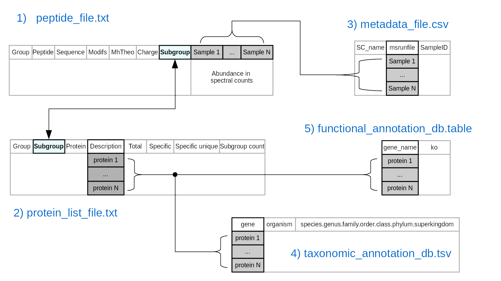

# metaprotr: R package for post-processing metaproteomics data

## Description

Set of tools for descriptive analysis of metaproteomics data generated from 
high-throughput mass spectrometry instruments. These tools allow 
to cluster peptides and proteins abundance, expressed as spectral counts, and to manipulate them in groups of metaproteins.

This information can be represented using multiple visualization functions to 
portray the global metaproteome landscape and to differentiate samples or 
conditions, in terms of abundance of metaproteins, taxonomic levels and/or 
functional annotation.

The provided tools allow to implement flexible analytical pipelines that can 
be easily applied to studies interested in metaproteomics analysis.

## Application case

### Pipeline to analyse the metaproteomes of gut microbiota

A curated [R script](https://forgemia.inra.fr/pappso/metaprotr/-/blob/master/inst/scripts/pipeline_intestinal_microbiota.R) is available with the detailed instructions to analyse intestinal microbiota. 

### Data inputs

The required files to use the package are :

1. Peptide abundances expressed as spectral counts. This file is generated from [X!Tandempipeline](http://pappso.inrae.fr/bioinfo/xtandempipeline/) using an adapted iterative approach described by [Bassignani, 2019](https://www.theses.fr/2019SORUS043). Contact [PAPPSO](http://pappso.inrae.fr/travailler_avec_nous/contact/) for more details. This file should have the first seven columns named: 
  * **Group**: protein group number, proteins are grouped together if they share at least one peptide
  * **Peptide**: a unique reference of the identified peptide
  * **Sequence**: peptide sequence
  * **Modifs**: textual informations of peptide modifications
  * **MhTheo**: theoretical MH+ of the peptide
  * **Charge**: list of all possible peptides charges
  * **Subgroup**: protein subgroup number, proteins inside a group sharing exactly the same set of peptides (indistinguishable)
  * The next columns should contain the peptide abundances as spectral counts. The **name of the columns** should be identical to the content of the column **msrunfile** from the metadata information.

2. List of protein names associated to the identified peptides. This file should have eight columns named:
  * **Group**: protein group number, proteins are grouped together if they share at least one peptide
  * **Subgroup**: protein subgroup number, proteins inside a group sharing exactly the same set of peptides (indistinguishable)
  * **Protein**: protein number, a single reference to the protein inside the subgroup
  * **Description**: protein information obtained from the fasta database at the stage of identification
  * **Total**: total number of spectra per protein
  * **Specific**: total number of spectra that are specific to a subgroup of proteins. It is only available if there are more than one subgroup within a group
  * **Specific Unique**: number of unique peptide sequence specific to this subgroup of proteins. It is only available if there are more than one subgroup within a group.
  * **SubGroup count**: number of subgroups (also known as metaproteins) per group

3. Metadata information. At least three columns must be present and named as: 
  * **SC_name**: sample names assigned by the user
  * **msrunfile**: name of samples as indicated in the corresponding columns of peptide abundances
  * **SampleID**: the content should indicate the experimental groups
  * Additional columns containing complementary information can be added by the user (ex. replicates, order of injection, etc.). The separation between columns should be indicated by tabulation

4. Catalog of genes with taxonomic annotations with the following format:
  * The first column named **gene** must contain the same identifiers of those present in the column **Description** from the list of proteins 
  * Another column named **organism** containing the name of the strain assigned to a given protein
  * A column named **species.genus.family.order.class.phylum.superkingdom**. The taxonomic classification can be obtained from a tool of sequences aligment and must be ordered by species, genus, family, order, class, phylum and superkingdom. The characters inside must be concatenated by a comma (ex."Streptococcus anginosus,Streptococcus,Streptococcaceae,Lactobacillales,Bacilli,Firmicutes,Bacteria"). For the application case you can download the Integrated non-redundant Gene Catalog (IGC) 9.9 database. 

5. Functional annotations of genes (optional). The functional annotations from the Kyoto Encyclopedia of Genes and Genomes (KEGG) were added to the IGC 9.9 database.  . This file should include two columns named:
  * **gene_name**: indicating the same protein names to those present in the **gene** column from the file with taxonomic annotations 
  * **ko**: indicating the KEGG Orthology code assigned to a given protein

### Documentation

Checkout the [**documentation**](https://forgemia.inra.fr/pappso/metaprotr/-/blob/master/inst/documentation/metaprotr_1.2.2.pdf) and the [**cheatsheet**](https://forgemia.inra.fr/pappso/metaprotr/-/blob/master/inst/cheatsheet/cheatsheet_metaprotr.pdf) that displays the available functions on **metaprotr**.

## Contribute to the project

Everybody is welcome to contribute to the **metaprotr**.

### Indicate errors :warning: :bangbang:

If you found an error please describe it in the [issues section](https://forgemia.inra.fr/pappso/metaprotr/-/issues) and address it to the package mantainer.

**Please provide the following information**:
  * Summarize the bug encountered concisely.
    * What is the current bug behavior?
    * What is the expected correct behavior?
  * Describe the steps to reproduce it.
  * Paste logs and/or screenshots.
  * Add possible fixes.

### Add modifications :star: :thumbsup:

To improve, modify or add a **new feature/function** to the project please follow this procedure:

1. Create a new branch from **"stable"** and name it with the feature/function that you will work on.

2. Make changes and commits to this branch while developing. 

  When making commits it is recommended to use the following graphical identifiers:
  
  | Identifier 	      | Code                      |  Description |
  |-----------------------|------------------------:|----------------:|
  | :lollipop:              | : lollipop : 	     | Minor change (ex. comment, renaming) |
  | :pencil2: 	      | : pencil2 :  	     | New code  |
  | :wrench:              | : wrench : 	     |  Code refactoring |
  | :checkered_flag: | : checkered_flag : | code test, check or verification |
  | :bug: 		     | : bug : 		     | bug detected |
  
  Example: 
  
      git commit -m ':pencil2: writing core logic of an awesome function'

3. Make a pull request to the branch **"stable"**.
